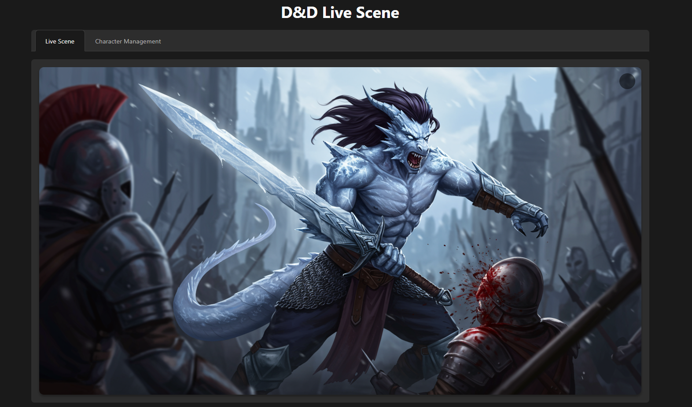
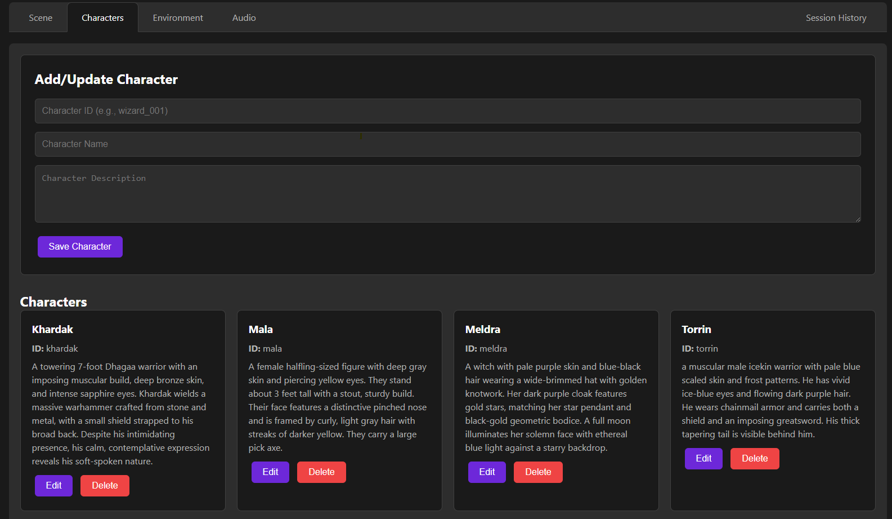

# D&D Live Scene Generator

This project provides a real-time pipeline to capture live audio from a Dungeons & Dragons session, transcribe it using a local Whisper model, generate a detailed scene description via OpenAI GPT-4o, and create a corresponding image using Google's Imagen 3.0 API. The generated image is pushed to a live web dashboard for immediate viewing.


*Live scene generation with fullscreen toggle and real-time updates*


*Character management interface for maintaining consistent descriptions*

## Features

- **Live Audio Processing**: Captures and processes audio in real-time from your D&D session
- **Smart Scene Generation**: Uses GPT-4o to identify key moments and create vivid scene descriptions
- **Character Consistency**: Maintains character descriptions across generated scenes
- **Environment Management**: Automatically tracks and updates the game environment based on session context
- **Environment Locking**: Option to lock environment descriptions to prevent automatic updates
- **Real-time Updates**: Instantly displays generated images via Socket.IO
- **Fullscreen Mode**: Toggle fullscreen view with 'F' key or button
- **Character Management**: Simple interface to add, edit, and delete character descriptions

## Project Structure

```
project/
├── assets/
│   ├── preview.png        # Live scene interface preview
│   └── preview2.png       # Character management interface preview
├── client/
│   └── recorder.py        # Captures audio from your laptop and sends chunks to the server
├── server/
│   ├── app.py             # Main Flask & Socket.IO application
│   ├── config.py          # Central configuration settings
│   ├── transcribe.py      # Transcribes audio using the local Whisper model
│   ├── scene_composer.py  # Generates scene descriptions using GPT-4o
│   ├── image_generator.py # Generates images using Google's Imagen 3.0
│   ├── character_store.py # File-based character database (JSON)
│   ├── environment_store.py # File-based environment state management
│   ├── environment_analyzer.py # Analyzes transcripts for environment changes
│   ├── image_cache.py     # Manages caching of generated images
│   ├── templates/
│   │   └── index.html     # Web dashboard template
│   └── static/
│       └── js/
│           └── client.js  # Client-side JS for live updates
├── requirements.txt       # Python dependencies
└── README.md             # This file
```

## Installation

1. **Clone the Repository:**

   ```bash
   git clone https://github.com/yourusername/dd-live-scene.git
   cd dd-live-scene
   ```

2. **Create a Virtual Environment and Install Dependencies:**

   ```bash
   python3 -m venv venv
   source venv/bin/activate  # On Windows: venv\Scripts\activate
   pip install -r requirements.txt
   ```

3. **Install Additional Dependencies:**

   - For audio recording on the client:
     ```bash
     pip install sounddevice soundfile numpy requests
     ```
   - For transcription with Whisper:
     ```bash
     pip install git+https://github.com/openai/whisper.git
     ```

## Configuration

Copy the `.env.example` file to `.env` and update the following environment variables:

### API Keys
- `OPENAI_API_KEY`: Your OpenAI API key for GPT-4o
- `GEMINI_API_KEY`: Your Google API key for Imagen 3.0

### Flask Configuration
- `SECRET_KEY`: Flask secret key for session security (change in production)
- `FLASK_ENV`: Set to 'development' or 'production'
- `DEBUG`: Set to 'True' for development, 'False' for production

### Audio Recording Settings
- `CHUNK_DURATION`: Duration of each audio chunk in seconds (default: 60)
- `SAMPLE_RATE`: Audio sample rate in Hz (default: 44100)
- `CHANNELS`: Number of audio channels (default: 1)

### Data Storage
- `CHARACTER_DATA_PATH`: Path to store character data and cached images
- `ENVIRONMENT_DATA_PATH`: Path to store environment state data (defaults to CHARACTER_DATA_PATH)

All these settings can also be modified directly in `server/config.py` if preferred.

## Usage

1. **Start the Server:**

   ```bash
   python server/app.py
   ```

   The web interface will be accessible at [http://localhost:5000](http://localhost:5000)

2. **Run the Recorder Client:**

   ```bash
   python client/recorder.py
   ```

3. **Manage Characters:**
   - Navigate to the "Character Management" tab
   - Add characters with unique IDs, names, and descriptions
   - These descriptions will be used to maintain consistency in generated scenes

4. **Manage Environment:**
   - Navigate to the "Environment" tab
   - View and edit the current environment description
   - Toggle the lock switch to prevent automatic updates
   - Environment descriptions focus on location, atmosphere, time of day, and weather

5. **View Generated Scenes:**
   - The main tab shows the latest generated scene
   - Press 'F' or click the fullscreen button to toggle fullscreen mode
   - Press 'ESC' to exit fullscreen

## How It Works

1. The recorder captures audio in 60-second chunks
2. Each chunk is transcribed using Whisper
3. The transcript is analyzed for significant environment changes
4. If unlocked, the environment description is updated based on the analysis
5. GPT-4o analyzes the transcript, character descriptions, and current environment to identify key moments
6. A detailed scene description is generated, maintaining character and environment consistency
7. Google's Imagen 3.0 creates an image based on the description
8. The image is displayed in real-time on the web dashboard

### Environment Management

The environment system maintains a persistent description of the game's current setting. This description is:

- **Automatically Updated**: The system analyzes each audio transcript for significant location or setting changes
- **Conservative**: Only updates when there's clear evidence of a meaningful change
- **Lockable**: Can be locked to prevent automatic updates during important scenes
- **Manually Editable**: Users can directly edit the description through the UI
- **Context-Aware**: Provides consistent context for scene generation
- **Focused on Visuals**: Emphasizes elements that would appear in an image (location, lighting, weather, etc.)

## License

This project is licensed under the MIT License.
